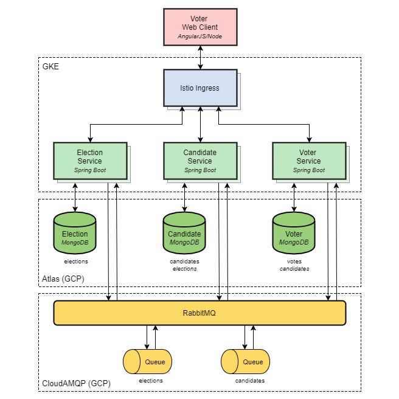

[](https://travis-ci.org/garystafford/election-service) [](https://microbadger.com/images/garystafford/election-service "Get your own image badge on microbadger.com") [](https://microbadger.com/images/garystafford/election-service "Get your own version badge on microbadger.com")

# Election Service

## Introduction

The Election [Spring Boot](https://projects.spring.io/spring-boot/) Service is a RESTful Web Service, backed by MongoDB, using Atlas on GCP, and RabbitMQ, using CloudAMQP on GCP. It is part of the Voter API project (see below). The Election service exposes several HTTP API endpoints, listed below. API users can manage elections, and inspect technical information about the running service.


## Election Service Endpoints

The service uses a context path of `/election`. All endpoints must be are prefixed with this sub-path.

Purpose                                                                                                                  | Method  | Endpoint
------------------------------------------------------------------------------------------------------------------------ | :------ | :-----------------------------------------------------
List All Service Endpoints                                                                                               | GET     | [/election/mappings](http://localhost:8095/election/mappings)
Create Election                                                                                                          | POST    | [/election/elections](http://localhost:8095/election/elections)
Read Election                                                                                                            | GET     | [/election/elections/{id}](http://localhost:8095/election/elections/{id})
Read Elections                                                                                                           | GET     | [/election/elections](http://localhost:8095/election/elections)
Update Election                                                                                                          | PUT     | [/election/elections/{id}](http://localhost:8095/election/elections/{id})
Delete Election                                                                                                          | DELETE  | [/election/elections/{id}](http://localhost:8095/election/elections/{id})
Drop All Elections                                                                                                       | POST    | [/drop/elections](http://localhost:8095/election/drop/elections)
Service Info                                                                                                             | GET     | [/election/info](http://localhost:8095/election/info)
Service Health                                                                                                           | GET     | [/election/health](http://localhost:8095/election/health)
Other [Spring Actuator](http://docs.spring.io/spring-boot/docs/current/reference/htmlsingle/#production-ready) endpoints | GET     | `election/actuator`, `election/metrics`, `election/env`, `election/configprops`, etc.
Other [HATEOAS](https://spring.io/guides/gs/rest-hateoas) endpoints for `/election/elections`                            | Various | page sort, size, etc.

The [HAL Browser](https://github.com/mikekelly/hal-browser) API browser for the `hal+json` media type is installed alongside the service. It can be accessed at `http://localhost:8095/election/actuator/`.

## Elections

Creating a new election requires an HTTP `POST` request to the `/election/elections` endpoint, as follows:

Using [HTTPie](https://httpie.org/) command line HTTP client.

```bash
http POST http://localhost:8095/election/elections \
  date='2008-11-04' \
  electionType='FEDERAL' \
  title='2008 Presidential Election' \
  description='56th quadrennial American presidential election'
```

## Sample Output

```bash
http POST http://localhost:8095/election/elections \
  date='2008-11-04' \
  electionType='FEDERAL' \
  title='2008 Presidential Election' \
  description='56th quadrennial American presidential election'
```

wget

```bash
wget --method POST \
  --header 'content-type: application/json' \
  --body-data '{ "electionType": "2008-11-04", "electionType": "FEDERAL", "title": "2008 Presidential Election", "description": "56th quadrennial American presidential election" }' \
  --no-verbose \
  --output-document - http://localhost:8095/election/elections
```

```text
HTTP/1.1 201
Access-Control-Allow-Credentials: true
Access-Control-Allow-Headers: Content-Type, Accept, X-Requested-With, remember-me
Access-Control-Allow-Methods: POST, GET, OPTIONS, DELETE
Access-Control-Max-Age: 3600
Content-Type: application/json;charset=UTF-8
Date: Mon, 15 May 2017 00:05:57 GMT
Location: http://localhost:8095/election/elections/5918f0e51162e16da6d1cb8c
Transfer-Encoding: chunked
X-Application-Context: Election Service:8095
```

```json
{
    "_links": {
        "election": {
            "href": "http://localhost:8095/election/elections/5918f0e51162e16da6d1cb8c"
        },
        "self": {
            "href": "http://localhost:8095/election/elections/5918f0e51162e16da6d1cb8c"
        }
    },
    "date": "2008-11-04T00:00:00.000+0000",
    "electionType": "FEDERAL",
    "title": "2008 Presidential Election",
    "description": "56th quadrennial American presidential election"
}
```
